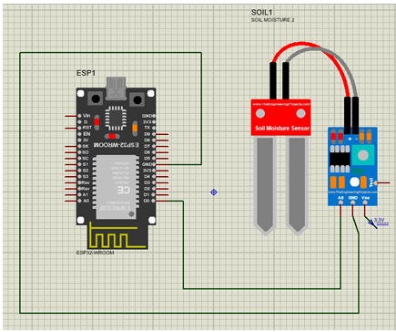

# Smart Water Level Monitoring Clamp (H2O Level Clamp)

This project includes patented technology. Unauthorized commercial use is prohibited.

---

## Overview

The Smart Water Level Monitoring Clamp is an ESP32-based IoT system designed to monitor water levels in real time. It integrates with the Blynk platform to provide remote monitoring and automated alerts, helping prevent overflow and improve water management efficiency.

---

## Features

* Real-time water level monitoring
* Remote access using Blynk IoT platform
* Automated alerts when threshold level is reached
* Simple clamp-based installation on water tanks
* Reduces water wastage and prevents overflow

---

## Tech Stack

* ESP32 Microcontroller
* Arduino IDE
* Blynk IoT Platform
* Embedded C/C++

---

## Project Preview



---

## Circuit Explanation

The system consists of three main components: **ESP32**, **Soil Moisture Sensor Probe**, and **Signal Conditioning Module**.

### Components Used

* ESP32 Development Board
* Soil Moisture Sensor (Probe + Module)
* Jumper Wires

---

### Working Principle

* The soil moisture sensor acts as a **water level detector**.
* When water touches the probe, the conductivity changes, producing an analog signal.
* This signal is sent to the ESP32, which processes it and converts it into a percentage value.
* The processed data is sent to the Blynk cloud over Wi-Fi.
* When the water level crosses a predefined threshold, an alert is triggered.

---

### Pin Connections

| Component                 | ESP32 Pin |
| ------------------------- | --------- |
| Sensor VCC                | 3.3V      |
| Sensor GND                | GND       |
| Sensor Analog Output (AO) | GPIO 34   |

---

### Data Flow

1. Sensor detects moisture (water presence)
2. Analog signal sent to ESP32
3. ESP32 processes and maps value to percentage
4. Data transmitted to Blynk
5. Alert generated when threshold is reached

---

## Repository Structure

```
smart-water-level-monitoring-clamp/
│
├── code/
│   └── water_level.ino
│
├── design/
│   ├── soil-moisture-sensor-probe/
│   ├── soil-sensor/
│   ├── clamps/
│   ├── clamp-components/
│   └── esp32-mount/
│
├── circuit-water_level_sensor.png
├── LICENSE
└── README.md
```

---
## License and Usage

- Code is licensed under the MIT License  
- The mechanical design is protected under a filed patent  
- Commercial use, reproduction, or manufacturing without permission is strictly prohibited
- Application Number: 454245-001

## How It Works

The clamp device is attached internally to a water tank. The sensor continuously monitors the water level and sends readings to the ESP32. The ESP32 uploads this data to the Blynk platform via Wi-Fi. When the water level exceeds or falls below a set threshold, the system automatically notifies the user.

---

## Setup Instructions

### 1. Install Software

* Install Arduino IDE
* Install ESP32 board support
* Install required libraries:

  * WiFi
  * Blynk

---

### 2. Configure Credentials

Create a configuration file or update:

* Wi-Fi SSID and Password
* Blynk Authentication Token

---

### 3. Upload Code

* Connect ESP32 via USB
* Select correct board and COM port
* Upload the `.ino` file

---

### 4. Run the System

* Open Serial Monitor (115200 baud)
* Monitor sensor values
* Check Blynk dashboard for live updates

---

## Patent Information

* Status: Filed
* The core design and working principle of this system are protected under a patent

---

## License and Usage

* Code is licensed under the MIT License
* Design and hardware concept are restricted
* Commercial use or manufacturing without permission is prohibited

---

## Applications

* Domestic water tank monitoring
* Industrial water management
* Smart home automation systems
* Agricultural water storage monitoring

---

## Future Improvements

* Mobile push notifications
* Integration with mobile apps
* AI-based water usage prediction
* Battery-powered standalone system

---

## Contact

For collaboration or commercial licensing:
hareshrobotics@gmail.com
